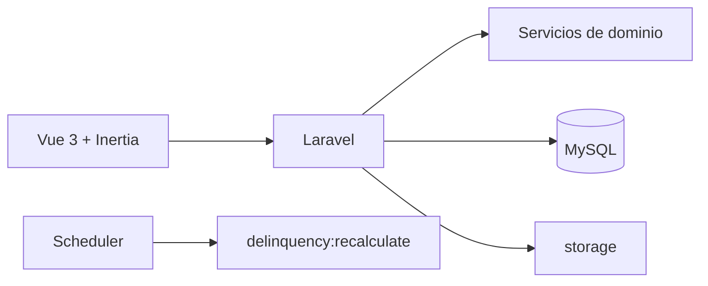

# Arquitectura

El backend usa Laravel con rutas web, controladores, Form Requests, middleware y servicios. El frontend Vue 3 se entrega por Inertia y Vite. La autorización de módulos se aplica mediante `EnsureModuleAccess` y `PermissionService`.

Los servicios financieros concentran operaciones como solicitudes, pagos, mora y contabilidad. Las operaciones monetarias deben preservar transacciones, bloqueos e idempotencia definidos por el código. La base de datos almacena sesiones, caché y colas cuando se seleccionan los drivers `database`.
